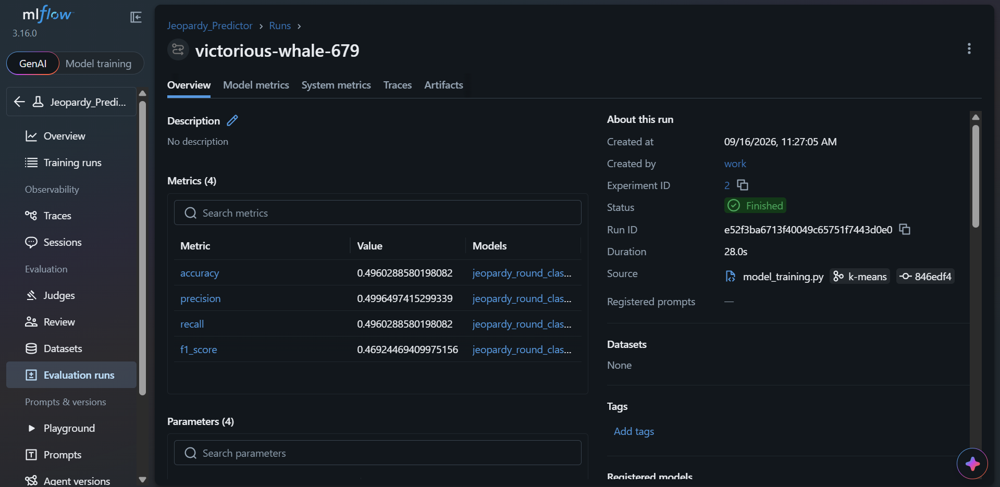
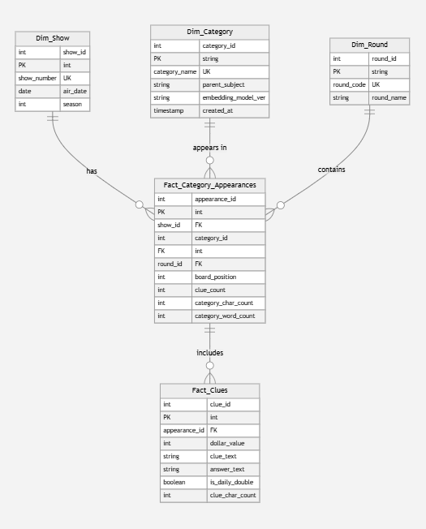

# 🏆 Jeopardy! Semantic Trend Analysis & MLOps Pipeline


An end-to-end **Data Engineering and MLOps pipeline** designed to scrape, clean, semantically classify, and model historical *Jeopardy!* category metadata. 

This project transforms unstructured text into a production-grade **Star Schema Data Warehouse**, applies **Zero-Shot NLP Embeddings** (`all-MiniLM-L6-v2`) via Cosine Similarity to map categories into core subject domains, and leverages **MLflow** for experiment tracking and model governance.

---

## 📸 Project Visuals

> [!NOTE]
> Screenshots of the running MLOps tracking UI and data model architecture.

<div align="center">

| MLflow Experiment Tracking | Dimensional Star Schema Model |
| :---: | :---: |
|  |  |
| *Tracking hyperparameters, F1-scores, and model artifacts* | *Fact_Category_Appearances linked to dimension tables* |

</div>

---

## 📐 System Architecture

```text
                                  [ Raw CSV Data ]
                                         │
                                         ▼
                     [ Zero-Shot NLP Classification Pipeline ]
                   (Sentence Transformers + Cosine Similarity)
                                         │
                                         ▼
                     [ DataOps & Quality Integrity Engine ]
                     (Schema, Foreign Keys, Null Validation)
                                         │
                                         ▼
                      ┌──────────────────────────────────┐
                      │   Star Schema Data Warehouse     │
                      │ ──────────────────────────────── │
                      │  • Dim_Category (Parent Domain)  │
                      │  • Dim_Round                     │
                      │  • Fact_Category_Appearances     │
                      └────────────────┬─────────────────┘
                                       │
                                       ▼
                     [ MLOps & Machine Learning Pipeline ]
                   (Scikit-Learn RandomForest + MLflow Tracking)
                                       │
                                       ▼
                             [ MLflow Dashboard UI ]
